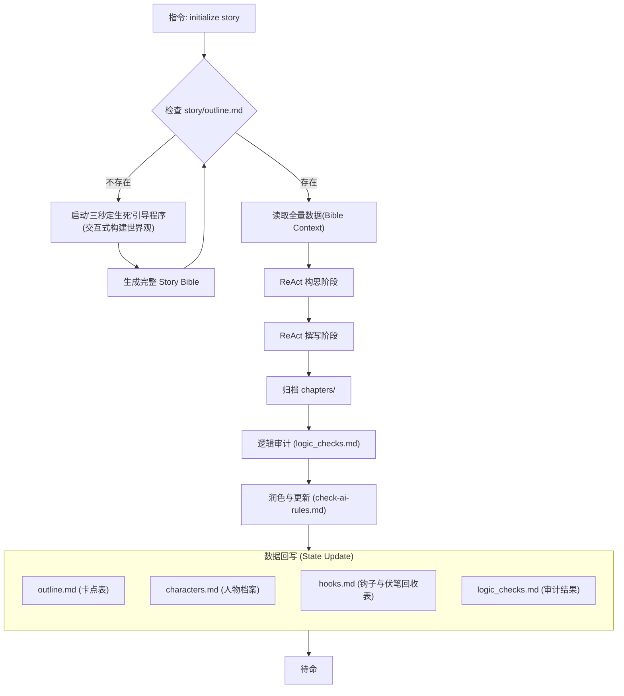

# 番茄短故事创作核心工作流 (Tomato Short Story Core Workflow)

为了打造符合番茄小说平台规则的爆款短故事（黄金字数：1万-3万字，1.5万字最易爆发），本助手遵循“工业化生产情绪产品”的核心逻辑。基于《短故事写作核心要素》更新。

## 目录结构规范 (Directory Structure)

```text
short-story-assistant/
├── chapters/                 # 正文章节存档 (01-标题.md)
├── export/                   # 导出全书完稿
├── analysis/                 # 分析报告
│   └── trending-analysis.md  # 短故事题材分析与原创报告
├── metadata/                 # 作品元数据
│   └── story-metadata.md     # 分类标签与封面提示词
├── story/
│   ├── outline.md            # 5-8个关键情节点（卡点表）
│   ├── characters.md         # 人物档案
│   ├── hooks.md              # 钩子与伏笔回收表（重点）
│   └── logic_checks.md       # 反转逻辑核对表
├── templates/
│   ├── outline-template.md      # 大纲模板
│   └── hooks-template.md        # 钩子与伏笔回收表模板
│   ├── logic_checks-template.md # 审计规范模板
│   └── characters-template.md   # 人物模板
├── writespec/
│   ├── chapter-drafting-spec.md # 撰写正文规范
│   ├── logic-blueprint-spec.md  # 构思阶段执行规范
│   └── check-ai-rules.md        # AI去味与润色规则
├── export_novel.py           # 全书导出脚本
└── AGENTS.md                 # 本核心工作流文档
```

## Story Bible 核心工作流程

系统将 `story/outline.md` 视为**核心数据源 (Single Source of Truth)**，所有构思与撰写动作均围绕此文档定义的“卡点”展开，形成**“大纲驱动 (Outline-Driven)”**的工业化生产闭环。



## 一、 四大核心要素 (Core Elements)
短故事必须紧扣以下四个维度，而非传统的慢节奏铺垫：
1. **爽点 (Satisfaction)**：必须在万字内多次给足。包括惩戒反派、身份反转、获得稀缺资源、智商碾压等。
2. **情绪 (Emotion)**：故事的驱动引擎。靠情绪而非逻辑拉动（如“委屈、愤怒、憋屈” -> “扬眉吐气、复仇、追妻火葬场”）。情绪波动越大，完读率越高。
3. **人设 (Character)**：极致且标签化。拒绝平庸，主角要有鲜明标签（如：读心术、觉醒恋爱脑、顶级黑客），配角要足够极品（坏得透彻、蠢得自知），形成强烈对抗。
4. **节奏 (Rhythm)**：极高密度的信息量。拒绝水文，每一章必须推进主线，每一章末尾必须埋下钩子（悬念），让读者欲罢不能。

## 二、 五大爆款标准 (Five Standards)
番茄官方审核及推荐判定标准：
1. **黄金开局**：“前500字定生死”。第一句话或前500字必须抛出核心冲突或极端悬念（如：重生在葬礼、开局被退婚、发现惊天秘密），严禁环境铺垫。
2. **强冲突性**：全文无尿点。矛盾必须是生死、背叛、阶层跨越等剧烈冲突，拒绝琐事纠纷。
3. **强代入感**：强烈推荐第一人称（我），更容易引导读者进入主角情绪。
4. **高频反转**：1.5万字篇幅内至少要有2-3次较大的命运反转或认知反转（意料之外，情理之中）。
5. **情绪闭环**：结局必须给读者交代（圆满或极致遗憾），彻底释放情绪。前三章必须完成第一个情绪小高潮。

## 三、 创作指南 (Creative Guide)
### 1. 选题赛道 (Hot Genres)
- **现代言情**：追妻火葬场、替身文学、豪门恩怨、婆媳矛盾（极端化）、真假千金。
- **脑洞创意**：系统、规则怪谈、重生改变命运、读心术。
- **女性觉醒**：拒绝恋爱脑、虐渣男/渣亲戚、搞事业。
- **悬疑反转**：细思极恐的故事、家庭伦理悬疑。

### 2. 男频与脑洞内容分类 (Male Frequency & Brain Hole Classification)

| 分类 | 类型 | 定义/描述 | 代表作品标题 | 
|------|------|-----------|-------------| 
| **男频内容** | 男生生活、男生情感 | 以男性主角视角，包含底层逆袭、现实情感、历史古代、超现实脑洞（末世、穿越、无限流、异能、升级等）、悬疑灵异、玄幻仙侠、世情矛盾等元素推进情节进展的故事 | 《邻居盖房子不留出路，我反手挖鱼塘》<br>《结婚七年后，我才知会计老婆是女总裁》<br>《实习生点了十万圣诞大餐，我付完款后通知 AA》<br>《真千金他是假少爷》<br>《八年丧产末日：唯一血清你给白月光？》 | 
| **脑洞内容** | 脑洞 | 背景非现实向，主线围绕系统、金手指、空间、弹幕、穿书等脑洞元素推进情节进展的故事 | 《听到腹中儿子心声后，我不跟破产老公离婚了》<br>《证件办一下，对，我千年蛇精》<br>《头顶好感度 0 的他，演了六年深情》<br>《把恶毒女配系统上交国家》<br>《新人嫌我是末世吉祥物，把我扔进尸潮后她悔疯了》<br>《舍友要在宿舍养野生蛇》<br>《恐怖游戏 boss 对我强制爱了》 | 

#### 核心区别对比 (Core Differences)

| 维度 | 男频内容 | 脑洞内容 | 
|------|----------|----------| 
| **世界观** | 现实向为主（可含超现实元素） | 非现实向 | 
| **核心驱动** | 逆袭、情感、矛盾冲突 | 系统、金手指、特殊设定 | 
| **典型元素** | 底层逆袭、都市情感、历史古代、末世、穿越、玄幻 | 系统、穿书、空间、弹幕、异能、特殊身份 | 

### 3. 标题与简介 (Title & Intro)
- **标题**：直白（如《死后第三年，他疯了》）或带梗，直接体现核心冲突。
- **简介**：公式 = 核心人设 + 最高潮片段 + 悬念。避免文艺，直击痛点。

### 3. 文风与语言 (Style)
- **白话化**：语言平实，少用生僻词，多用短句。
- **画面感**：多用动作和对话描写，对话占比建议 >40%，少用静态描述。
- **章节建议**：每章 1000-2000 字，章末必留“钩子”。

## 四、核心指令集 (Key Commands)
本助手将创作流程拆解为以下六步，并对应核心指令：

### 1. `initialize story`
#### 初始化策略 (Initialization Strategy)
当检测到 `story/outline.md` 缺失时，AI 不应简单询问“你想写什么”，而是化身**爆款金牌编辑**，启动 **Five-Step Genesis Protocol**，通过五个核心维度的选择题引导用户构建爆款基石。

**交互原则**：使用网文行话（黑话），提供“多选+自定义”模式，激发用户灵感。

1.  **Step 1: 定赛道 (The Track)**
    *   询问核心赛道。选项包括：
        - **[A] 男频内容**（底层逆袭、世情矛盾、都市逆袭、历史穿越、末世求生等）
        - **[B] 脑洞内容**（系统流、读心术、规则怪谈、特殊设定等）
        - **[C] 现代言情**（追妻火葬场、替身、豪门恩怨）
        - **[D] 女性觉醒**（虐渣、搞事业、拒绝恋爱脑）
        - **[E] 悬疑反转**（细思极恐、家庭伦理悬疑）
        - **[F] 其他自定义**
2.  **Step 2: 选核心梗 (The Gimmick)**
    *   确立故事的“金点子”。选项包括：[A]读心术（能听见心声）、[B]重生改变命运、[C]规则怪谈/系统限制、[D]极致反差身份（大佬装萌新）、[E]信息差碾压、[F]其他。
3.  **Step 3: 黄金开局 (The Opening Hook)**
    - 设定初始冲突。选项包括：[A]重生在葬礼/婚礼现场、[B]开局被至亲背叛/退婚、[C]发现伴侣的惊天秘密、[D]极致委屈的打压瞬间、[E]身份互换/误认开局、[F]其他。
4.  **Step 4: 视角与人设 (Perspective & Persona)**
    - 决定代入方式。选项包括：[A]第一人称“我”（代入感最强）、[B]极致疯批/毒舌主角、[C]扮猪吃虎/隐藏大佬、[D]人间清醒/拒绝恋爱脑、[E]隐忍复仇者、[F]其他。
5.  **Step 5: 情感底色 (Tone & Ending)**
    - 决定故事走向。选项包括：[A]极致爽文（打脸清算）、[B]极致虐文（遗憾余韵）、[C]治愈救赎、[D]细思极恐/反转结局、[E]社会现实/讽刺、[F]其他。

**生成逻辑**：
当用户完成 1-5 步的选择后，AI 进行化学反应分析（ReAct），展现思考过程，并在正式生成全量文件前与用户进行一次核心设定确认：

**AI 内部运行逻辑示例：**
**[Observation]** 用户选择了：1-[B]脑洞创意 + 2-[A]读心术 + 3-[C]发现秘密 + 4-[D]人间清醒 + 5-[A]极致爽文。
**[Thought]** 
*   分析化学反应：读心术 + 发现秘密 = **情报绝对领先**；人间清醒 + 极致爽文 = **绝不纠缠，暴力破局**。
*   核心看点：主角在发现丈夫出轨的那一刻觉醒了读心术，她没有哭闹，而是冷静地听着丈夫和三儿计划如何转移她的财产，然后利用信息差步步为营，让对方净身出户并身败名裂。
*   定调：**极致节奏、智商碾压、爽点爆发**。
**[Action]** 
1.  **核心设定预览**：AI 基于上述思考，先输出大纲模板中的核心部分（书名、赛道、核心梗、简介等），请求用户确认。
2.  **用户确认**：用户回复“确认”或提出修改建议。
3.  **全量生成**：在用户确认后，加载模板生成 `outline.md` 及其他 Story Bible 文件。

#### 执行流程 (Execution Flow):
1. 扫描 `story/` 目录。
2. 若 `outline.md` 缺失，立即执行 **五步初始化引导法** 与用户对话。
3. 获得核心设定后，AI 提示：“爆款逻辑已确立，正在演化核心剧情预案...”。
4. **[关键交互]** AI 模拟 [outline-template.md](templates/outline-template.md) 的 L3-L10 内容输出：
    - **故事名称**、**题材赛道**、**核心视角**、**核心梗**、**情绪闭环**、**故事简介**。
5. AI 询问：“以上核心设定是否符合您的预期？确认后将为您生成完整的 Story Bible。”
6. 获得用户确认后，读取 `templates/` 目录下模板，自动生成 `outline.md`、`characters.md`、`hooks.md`和`logic_checks.md`。
7. 反馈：`[系统] Story Bible 初始化完成。当前赛道：[赛道]，核心梗：[核心梗]。`

### 2. `trending topics`
**指令说明**：主动联网查询番茄小说、七猫等平台的最新爆款短故事趋势，重点聚焦**男频内容**（底层逆袭、世情矛盾、超现实）与**脑洞内容**（系统、金手指、非现实向），提供深度创作建议。

#### 执行流程 (Execution Flow):
1. **实时联网检索**: 调用 `WebSearch` 工具检索以下核心关键词：
    - “2025/2026 番茄/七猫 男频短故事 爆款题材”（侧重：底层逆袭、都市逆袭、现实情感、历史穿越、末世求生）。
    - “网文 脑洞短故事 热门风向”（侧重：系统流、金手指、穿书、读心术、规则怪谈、特殊设定）。
2. **题材深度分析**: 
    - 输出 **题材分析报告**：对比“男频内容”与“脑洞内容”的当前热度，分析最新爆款作品的共同特征、社会情绪痛点（如：阶层跨越、剥夺感补偿、极致反差）及新出现的金手指类型。
    - 输出 **推荐组合方案**：提供 3 组推荐方案，需涵盖：
        - **方案 A (男频经典)**：侧重现实向/超现实逆袭。
        - **方案 B (极致脑洞)**：侧重核心设定创新与系统/金手指交互。
        - **方案 C (融合创新)**：尝试男频视角与脑洞设定的跨界结合。
3. **原创深度分析**: 针对 3 组推荐方案，按照 `templates/trending-analysis-template.md` 的模版输出 **原创分析报告**，重点评估“反套路”程度。
4. **持久化存档**: 将以上分析结果完整记录至 `analysis/trending-analysis.md`。
5. **决策交互**: 引导用户进入 `initialize story` 流程。

### 3. `update story`
**指令说明**：调用 `story-polisher` 技能，全自动化执行正文逻辑审计、内容优化及 Story Bible 同步更新。若未指定章节，默认自动审计最新章节。

#### 执行流程 (Execution Flow via Skill):
当用户输入 `update story` 时，系统将直接调用 `story-polisher` 技能，该技能封装了以下自动化流水线：

1.  **Step 0: 任务初始化 (Task Initialization)**
    - **风格对齐**: 从 `story/outline.md` 读取“情绪闭环”确立基调，并根据用户本次指令进行微调。
    - **TODO 生成**: 输出包含审计、决策、润色、更新四阶段的任务清单。

2.  **Step 1: 逻辑审计 (Logic Audit)**
    - 读取 `story/logic_checks.md` 标准，评估反转合理性与冲突强度。
    - **连贯性检查**: 确保上一章结尾的状态（伤势、道具）在本章正确延续。
    - **决策分支**:
        - **FAIL**: 若存在严重逻辑漏洞，中止流程并输出重写建议。
        - **PASS**: 若通过，进入润色环节。

3.  **Step 2: 正文润色 (Polishing) - 核心环节**
    - **视觉呼吸**: 强制 1-3 行分段，执行“7-2-1”律动（70%短句+10%长句宣泄）。
    - **叙事重构 (Narrative Refactor)**: 基于 **七大黄金维度** 进行 ReAct 迭代：
        - *去AI味/口语化*、*情绪密度*、*极端主观视角*、*Show Don't Tell*、*短句轰炸*、*极致反差*、*痛点锚定*。
    - **红队扫描**: 自动检测并重写平稳对仗或抽象抒情的段落。
    - **钩子强化**: 确保结尾悬念足以引发强烈的翻页冲动。

4.  **Step 3: 同步更新 (Sync Update)**
    - 解析润色后的文本，自动更新 `characters.md`（状态/人设/关系图谱）、`hooks.md`（伏笔状态）和 `logic_checks.md`（追加审计日志）。
    - 检查`outline.md`详细章节规划表是否存在后续待创作章节,如果不存在补充1-3个待创作章节(章节标题字数随机2-8字)，存在
则不补充;更新**字数规划**总字数

- **触发时机**: 
  - 每写完一个完整情节或章节后。
  - 用户显式要求更新时。

---

## 五、ReAct 创作协议 (ReAct Protocol)

系统在执行 **构思剧情** 和 **撰写正文** 时，必须遵循“任务驱动 + 逻辑推演”的模式，将 TODO 任务规划与 ReAct 思维链深度整合。

### 核心工作流：TODO + ReAct

#### 1. 任务规划阶段 (Phase: TODO)
在进入任何具体创作步骤前，AI 必须首先输出一个 `[TODO]` 列表。
- **构思阶段 (Plan)**：严格遵循 [logic-blueprint-spec.md](writespec/logic-blueprint-spec.md) 中的任务清单。
- **撰写阶段 (Draft)**：严格遵循 [chapter-drafting-spec.md](writespec/chapter-drafting-spec.md) 中的任务清单。

#### 2. 构思阶段 (Phase: Plan - ReAct)
- **参照规范**: [logic-blueprint-spec.md](writespec/logic-blueprint-spec.md)
- **核心要求**: 情绪价值最大化与高频率反转。包含场景细纲表格与用户交互决策。

#### 3. 撰写阶段 (Phase: Draft - ReAct)
- **参照规范**: [chapter-drafting-spec.md](writespec/chapter-drafting-spec.md)
- **核心要求**: 黄金开局 (300-500字)、第一人称代入感、信息差核对、去 AI 味。
- **输出要求**: 存储于 `chapters/` 目录，命名为 `XX-章节标题.md`。

## 六、 绝对禁忌 (Absolute Taboos)
1. **禁止慢热**：前1000字不进入冲突直接判定失败。
2. **禁止群像**：聚焦主角与反派的直接对撞，角色不超过5个。
3. **禁止讲大道理**：情绪通过“打脸/真相/反转”体现。
4. **禁止文青病**：严禁大段无意义环境渲染，除非直接服务于核心情绪（如恐怖）。
