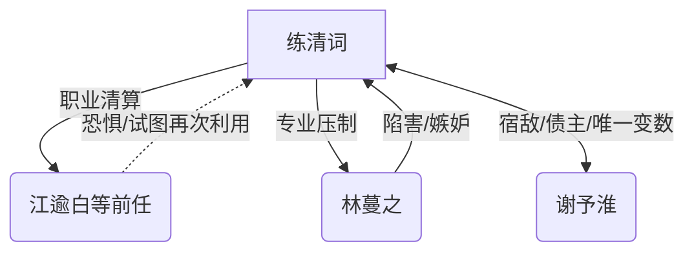

# 人设档案 (Characterization)

> 基于《番茄短故事创作核心工作流》第三步：人设标签化。

## 1. 核心阵容速览 (Cast Overview)

| 角色 | 姓名 | 核心标签 (番茄行话) | 情绪功能 (憋屈/爽点来源) | 核心信息差 |
| :--- | :--- | :--- | :--- | :--- |
| **主角** | 练清词 | 顶级舆论操盘手 / 降维打击 / 职业强迫症 | 职业化清算，智商碾压 | 资方授权的“违约清算师” / 掌握全员致命把柄 / AI算法真正开发者 / **[状态] 全书完。与谢予淮联手送顾老爷子入狱，接受求婚，接手星辉娱乐。** |
| **反派** | **林蔓之** | 算法剽窃绿茶 / 惯性小三 / 伪学霸 | 制造智力憋屈，随后被专业打脸 | 以为练清词没证据，不知道练就是算法原始代码拥有者 / **[状态] 全书完。身败名裂，背负巨额债务，彻底退圈。** |
| **反派** | **江逾白** | 傲慢影帝 / 过河拆桥 / 极致利己 |羞辱女主引发怒火，随后因学历造假塌房 | 以为练清词还爱他，实际上练在算他社会性死亡的倒计时 / **[状态] 全书完。学历造假被锤，被行业封杀，沦为素人。** |
| **反派** | 陆星野 | 归国爱豆 / 流量至上 / 忘恩负义 | 漠视女主，随后被曝出当年的公关全靠练 | 忘了练清词手里有他未剪辑的现场原片 / **[状态] 全书完。人设崩塌，面临巨额违约金。** |
| **反派** | 贺沉星 | 流量小生 / 暴躁易怒 / 嘴贱先锋 | 直接辱骂女主，拉满仇恨 | 以为现在的流量能保命，不知股价已穿仓 / **[状态] 全书完。破产，身负巨债。** |
| **反派** | 张导 | 势利眼导演 / 资本走走狗 / 流量至上 | 制造视觉压抑，随后被练的技术反杀 | 没意识到练清词对镜头语言的控制力远超于他 / **[状态] 全书完。因涉嫌职务侵占被立案调查。** |
| **神秘大佬** | 谢予淮 | 对冲基金大佬 / 资本猎人 / 练的“共谋前任” | 绝对财力压制 / 唯一能让练破功的人 | 表面是来收债，实则是当年那场“资本献祭”的唯一幸存者 / **[状态] 全书完。洗清冤屈，求婚成功，与练清词终成眷属。** |
| **幕后BOSS** | **顾老爷子** | 黑曜石戒指主人 / 资本巨鳄 / 伪善恩师 | 制造终极悬念与恐惧 | 谢予淮的恩师，试图吞并星辉和练清词资产 / **[状态] 全书完。因洗钱和操纵市场罪被捕入狱。** |

---

## 2. 主角深度档案 (Protagonist Deep Dive)

### 2.1 基础档案 (The ID Card)

| 属性 | 描述 | 备注/细节 |
| :--- | :--- | :--- |
| **姓名** | 练清词 | 姓氏冷门，更有智力感。 |
| **年龄/性别** | 24/女 | - |
| **外貌特征** | 骨相优越、冷白皮、典型的“高级脸” | 在镜头下自带一种神圣不可侵犯的疏离感。 |
| **明面身份** | 曾被全网黑退圈的“恋爱脑”女星 | 实际是在为大型资方进行“艺人风险评估”。 |
| **隐藏身份** | 顶级舆论操盘手“L”、星辉娱乐幕后控股人 | 娱乐圈一半的公关奇迹由她创造。 |
| **特殊技能** | 镜头语言大师、微表情风控、AI算法专家 | 能在三句话内让对方陷入逻辑自证的死循环。 |
| **性格缺陷** | 职业强迫症（视觉/逻辑） | 对构图不准、光影不对、逻辑有瑕疵的事物有生理性厌恶。 |
| **特殊经历** | 曾与谢予淮在资本市场联手，在三年前的一场战役中，为了洗出星辉背后的毒瘤，她主动选择“战败”离场并背负黑料。 | 所有的“恋爱”曾是她为了近距离观察星辉内部漏洞而做的“风控实验”。 |

### 2.2 内在扫描 (The ECG)

| 维度 | 内容 | 情绪逻辑/伏笔 |
| :--- | :--- | :--- |
| **性格标签** | 职业病重度患者、情绪绝对抽离、极致理智 | 哪怕在吵架，也在分析对方的呼吸频率和微表情。 |
| **核心金句** | “在这个镜头里，你的一举一动都在告诉我——你已经社会性死亡了。” | 展现降维打击的冷酷。 |
| **致命弱点** | 对谢予淮的“过敏反应” | 唯一一个能让她理智掉线、产生情绪波动的变数。 |
| **爽点触发器** | 当林蔓之试图利用“AI算法”打压练清词时 | 练清词直接指出底层Bug，揭开对方的伪装。 |
| **心声风格** | 冷静、专业、带有职业视角的犀利点评 | 将修罗场看作一场需要优化的公关危机。 |

### 2.3 核心男主 (The Male Lead)

| 属性 | 描述 | 备注/细节 |
| :--- | :--- | :--- |
| **姓名** | 谢予淮 | - |
| **身份** | 对冲基金大佬 / 资本猎人 / 练的“共谋前任” | - |
| **性格标签** | 毒舌且护短、顶级精算师、偏执的债主 | 表面冷酷，实则一直在为练清词的归来清场。 |
| **登场方式** | [第4章] 以“债主”身份空降 | 并没有给练清词打赏，而是直接带来了星辉娱乐的做空报告。 |
| **当前状态** | 憋着一股劲想让练清词求他 | 结果每次都被练清词反手撩得理智全无。 |

---

## 3. 极端反派档案 (Antagonist Deep Dive)

### 3.1 反派阵营速览 (The Villain Matrix)

| 反派姓名 | 核心标签 | 仇恨值 (1-5) | 作死动力 | 报应预设 |
| :--- | :--- | :--- | :--- | :--- |
| **林蔓之** | AI算法剽窃者 | ⭐⭐⭐⭐⭐ | 极度自卑导致的极度嫉妒。 | 被全网通报算法剽窃，星辉永久封杀，承担天价赔偿。 |
| **江逾白** | 伪善影帝 | ⭐⭐⭐⭐ | 害怕当年的“软饭经历”被揭穿。 | 学历造假被锤，所有代言违约赔死。 |
| **张导** | 势利眼导演 | ⭐⭐⭐ | 盲目迷信资本。 | 被资方反手抛弃，因违规拍摄被吊销执照。 |
| **贺沉星** | 暴躁小生 | ⭐⭐⭐ | 盲目自大，自以为是资本宠儿。 | 股价穿仓后，所有期权变废纸，负债累累。 |

### 3.2 详细档案 (Individual Deep Dives)

#### 林蔓之 - 算法剽窃绿茶

| 维度 | 内容 | 细节 (番茄爆款参考) |
| :--- | :--- | :--- |
| **极品标签** | 资深绿茶 / 伪学霸 / 惯性小三 | 表面温婉动人，实则毫无底线，惯用“我也不想这样”来道德绑架。 |
| **作死动力** | 极度嫉妒 | 练清词的才华让她感到窒息，只有彻底毁掉练清词，她才能心安理得地偷走对方的人生。 |
| **仇恨爆发点** | 剽窃练清词三年前的算法草稿 | 甚至在练清词落魄时，当众嘲讽练清词“根本不懂科技”。 |
| **虚伪逻辑** | “这算法在我手里才能发光。” | “清词，你已经退圈了，这些东西留着也是浪费，我是在帮你延续梦想。” |
| **核心弱点** | 极度自卑与专业能力缺失 | 离了练清词的代码，她连一个基本的 Bug 都修不好。 |
| **报应预设** | 科技人设崩塌 | 被全网通报剽窃，星辉娱乐为了自保将其永久封杀并索赔。 |
| **反转反应** | 悔不当初到疯魔 | 从趾高气昂展示礼物到直播间当众下跪求饶，最后在社交媒体上发疯式控诉。 |

#### 江逾白 - 伪善影帝

| 维度 | 内容 | 细节 (番茄爆款参考) |
| :--- | :--- | :--- |
| **极品标签** | 过河拆桥 / 利益至上 / 软饭硬吃 | 靠练清词的公关上位，成名后立刻翻脸，还反咬练清词“蹭热度”。 |
| **作死动力** | 虚荣心与恐惧 | 害怕练清词爆出他当年的落魄样，试图先下手为强，利用舆论彻底封杀练。 |
| **仇恨爆发点** | 恋综首日带头孤立女主 | 当众说出：“练小姐，请自重，我们已经没关系了。” |
| **虚伪逻辑** | “我只是追求更好的生活。” | “练清词，你给不了我想要的星途，林蔓之可以。你纠缠我只会让我觉得你廉价。” |
| **核心弱点** | 学历造假与软饭背景 | 极度爱惜羽毛，最怕别人说他是“靠女人上位”。 |
| **报应预设** | 彻底塌房 | 学历被实锤造假，公关黑料全线爆发，代言全掉，沦为过街老鼠。 |
| **反转反应** | 从嚣张到瘫痪 | 直播间里试图自证清白却被练清词当场拆穿，最后直接在沙发上瘫坐不起。 |

#### 张导 - 势利眼导演

| 维度 | 内容 | 细节 (番茄爆款参考) |
| :--- | :--- | :--- |
| **极品标签** | 资本走狗 / 流量至上 / 欺软怕硬 | 为了讨好资方，不惜恶意剪辑，制造练清词的负面形象。 |
| **作死动力** | 贪婪 | 以为练清词是弃子，只要踩死她就能换取星辉更大的投资。 |
| **仇恨爆发点** | 安排“死亡角度”灯光 | 在直播中故意给练清词难堪，甚至试图在后期剪辑中抹黑。 |
| **虚伪逻辑** | “为了节目效果。” | “练清词，你能上这个节目已经是恩赐了，牺牲一下名声怎么了？” |
| **核心弱点** | 职业违规与贪污公款 | 私下收受星辉回扣，且有严重的职场霸凌记录。 |
| **报应预设** | 职业生涯终结 | 被谢予淮直接撤资，并被行业协会吊销执照，面临刑事诉讼。 |
| **反转反应** | 卑微求饶 | 在发现练清词才是真正的清盘人后，当众自扇耳光。 |

#### 贺沉星 - 暴躁小生

| 维度 | 内容 | 细节 (番茄爆款参考) |
| :--- | :--- | :--- |
| **极品标签** | 嘴贱先锋 / 暴躁易怒 / 没脑子 | 仗着自己是当红流量，口无遮拦，对女主进行人身攻击。 |
| **作死动力** | 盲目自大 | 觉得练清词这种“黑料艺人”不配和他同框，试图通过辱骂她来立“真性情”人设。 |
| **仇恨爆发点** | 节目现场辱骂练清词 | 称其为“资本玩腻的破鞋”。 |
| **虚伪逻辑** | “我这是真性情。” | “我这人说话直，练清词你自己做了什么你自己清楚。” |
| **核心弱点** | 财务穿仓与税务问题 | 所有的流量都是靠杠杆买来的，经不起查。 |
| **报应预设** | 负债累累 | 股价崩盘后期权变废纸，因税务问题被查，沦为法制咖。 |
| **反转反应** | 彻底疯魔 | 从不可一世到在现场大吼大叫，最后被保安强行拖走。 |

### 3.3 坏人逻辑自洽审计 (Audit)

- [x] **仇恨是否拉满？** 是，剽窃、孤立、人身攻击、恶意剪辑，全方位覆盖。
- [x] **智商是否在线？** 是，反派基于信息差（不知道练的真实身份）和自负行动，逻辑自洽。
- [x] **爽点是否对应？** 是，反派最看重的科技名誉、影帝光环、导演权势、流量身价全部被精准剥夺。
- [x] **联动是否合理？** 是，反派之间互利互惠（江林联手），同时也存在利益倾斜（张导讨好资方）。

---

## 4. 重要配角档案 (Supporting Cast)

### 4.1 配角阵容速览 (The Cast Matrix)

| 配角姓名 | 功能标签 | 情感价值 | 关键转折点 | 立场稳定性 |
| :--- | :--- | :--- | :--- | :--- |
| **周特助** | 忠犬助理 / 吐槽担当 | 忠诚、爽点辅助 | 在第8章提供星辉财务造假的原始U盘。 | 绝对忠诚 |
| **林浅浅** | 恋爱脑表妹 (林蔓之妹) | 制造麻烦、侧面衬托 | 在第5章因嫉妒练清词而反水，爆出林蔓之的私生活料。 | 摇摆不定 |

### 4.2 详细档案 (Supporting Cast Deep Dives)

#### 周特助 - 忠犬助理

| 维度 | 内容 | 细节 (番茄爆款参考) |
| :--- | :--- | :--- |
| **功能标签** | 顶级打工人 / 信息收集器 | 练清词的左膀右臂，负责处理所有脏活累活。 |
| **情感价值** | 治愈与信任 | 给读者提供一种“女主背后有人”的安定感。 |
| **关键转折** | 提前渗透进星辉财务部 | 在练清词宣布清盘时，他拿出了压死骆驼的最后一根稻草。 |
| **立场偏移** | 无 | 哪怕练清词退圈三年，他也一直潜伏在暗处等待召唤。 |

---

## 5. 人物关系网 (Relationship Web)

### 5.1 关系图谱 (Mermaid Diagram)

