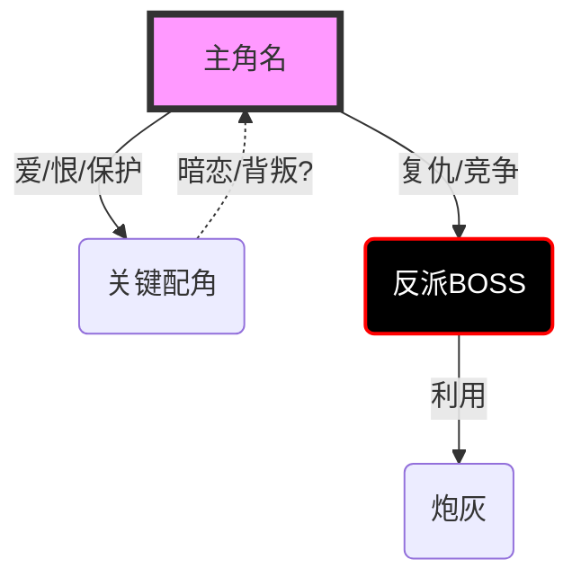

# 人设档案 (Characterization)

> 基于《番茄短故事创作核心工作流》第三步：人设标签化。

## 1. 核心阵容速览 (Cast Overview)

| 角色 | 姓名 | 核心标签 (番茄行话) | 情绪功能 (憋屈/爽点来源) | 核心信息差 |
| :--- | :--- | :--- | :--- | :--- |
| **主角** | [姓名] | [极致清醒/人间清醒] | [被误解后的降维打击] | [如：预知、读心、真实身份] |
| **反派** | [姓名] | [极品婆婆/绿茶闺蜜] | [制造极致憋屈/拉仇恨] | [对此一无所知，持续作死] |
| **配角** | [姓名] | [功能性标签] | [情感连接/信息传递] | [站队情况/关键时刻的反转] |

---

## 2. 主角深度档案 (Protagonist Deep Dive)

### 2.1 基础档案 (The ID Card)

| 属性 | 描述 | 备注/细节 |
| :--- | :--- | :--- |
| **姓名** | [Name] | - |
| **年龄/性别** | [Age/Gender] | - |
| **外貌特征** | [Appearance] | *抓取3个关键特征，用于建立视觉锚点* |
| **明面身份** | [Public Identity] | *日常生活的伪装身份* |
| **隐藏身份** | [Hidden Identity] | *爆款反差的核心（如：顶级黑客、财阀继承人）* |
| **特殊经历** | [Backstory] | *制造憋屈感或爽感来源的高光/阴影时刻* |

### 2.2 内在扫描 (The ECG)

| 维度 | 内容 | 情绪逻辑/伏笔 |
| :--- | :--- | :--- |
| **性格标签** | [Personality] | *番茄味：极致清醒、人间毒舌、顶级绿茶克星* |
| **核心金句** | [Signature Line] | *高频出现的口头禅，人设的核心记忆点* |
| **致命弱点** | [Fatal Flaw] | *【憋屈点来源】为何会被人欺压/误解？* |
| **爽点触发器** | [Satisfaction] | *【爽感来源】什么时候开始反击/揭露真相？* |
| **心声风格** | [Voice Tone] | *第一人称下的吐槽/冷酷/疯批风格，决定代入感* |

### 2.3 核心驱动力 (Core Drive)

- **核心目标 (Goal)**:
  > [他/她最想得到什么？具体！如：夺冠、复仇、救人]

- **核心动机 (Motivation)**:
  > [为什么非要不可？背后是爱、恨、恐惧还是责任？]

### 2.4 人物弧光 (Character Arc)

- **弧光类型**: [正向成长 / 负向堕落 / 平稳改变世界]
- **变化轨迹**:
  > 开头：[初始状态] -> 结尾：[最终状态]

---

## 3. 极端反派档案 (Antagonist Deep Dive)

> 为“爽点”服务的工具人，必须坏得有逻辑，死得够凄惨。

| 维度 | 内容 | 细节 |
| :--- | :--- | :--- |
| **极品标签** | [Extreme Tag] | *如：道德绑架高手、扶弟魔、利益至上* |
| **作死动力** | [Trigger] | *为什么非要针对主角？（嫉妒、贪婪、自大）* |
| **报应预设** | [Retribution] | *最能平息民愤的下场（如：净身出户、身败名裂）* |

## 4. 人物关系网 (Relationship Web)

### 3.1 关系图谱 (Mermaid Diagram)

### 3.2 关键互动说明

*   **与反派的矛盾**: [核心冲突点]
*   **与配角的羁绊**: [情感连接点]
